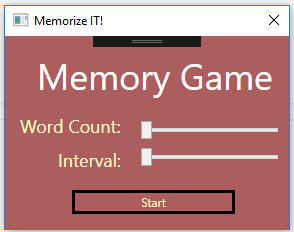
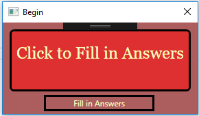
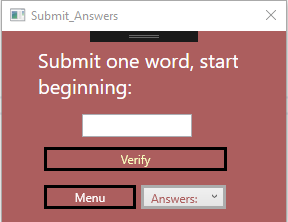

# Memory-Game

## Description

Small application to practice C#. Application is designed to allow the user to practice a memory techinque that does not involve soley rote learning. Each time the application is ran, a randomizer is used so you won't see the same order of words. 

User can use sliders to select how many words they would like to remember and the interval before a new word appears. 

 

Once the user clicks *start*, the words will start flashing on the screen. When the list has ran through, the user can then click on *fill in answers* 

The user is then brought to another screen, where they can start to fill in the answers. A drop-down box also exists, which contains all of the words in the list.

Program reads from a text file that contains a list of words, which is found in the Bin and then Debug folder

## To Run
On a Windows system navigate to the Memory Game folder and double click on Memory Game.sln, you have to add a text file with a list of words in the bin then debug folder in order to run the program.

## Todo
1. Figure out how to publish this app.
